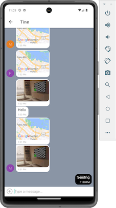

# Chirp

## React Native Chat App with Expo and Firestore

This is a chat application built using React Native, Expo, and Google Firestore Database. The app allows users to enter their name, choose a background color for the chat screen, engage in text conversations, send images, and share location data. The chat data is stored both online and offline using Google Firestore Database.

## Key Features

- **User Authentication:** Users can enter their name and choose a background color before joining the chat.
- **Conversations Page:** Display conversations with an input field and submit button for sending messages.
- **Image Sending:** Users can send images as part of their messages.
- **Location Sharing:** Users can share their current location as part of their messages.
- **Online and Offline Storage:** Chat data is stored in Google Firestore Database for online access and is cached for offline use.

## Screenshots



### Setting up the Development Environment

1. **Expo:** Set up an Expo account. Make sure you have Expo CLI installed. If not, you can install it globally using npm:

npm install -g expo-cli

2. **Android Studio:** If you plan to run the app on an Android emulator, you'll need to set up Android Studio. Follow the official Expo guide for instructions on setting up the Android development environment: [Expo Android Development Environment](https://docs.expo.dev/workflow/android-studio-emulator/)

### Database Configuration

This app uses Firebase as the backend database. To configure Firebase:

1. Visit the [Firebase Console](https://console.firebase.google.com/) and create a new project if you don't have one already. In the "Rules" tab, change "allow read, write: if false;" to "allow read, write: if true;"

2. Set up Firebase Authentication (Anonymous Authentication is used in this app) and Firestore Database. Make sure to enable anonymous authentication in Firebase.

3. Obtain the Firebase configuration object for your project. It should look something like this:

```javascript
const firebaseConfig = {
  apiKey: 'YOUR_API_KEY',
  authDomain: 'YOUR_AUTH_DOMAIN',
  projectId: 'YOUR_PROJECT_ID',
  storageBucket: 'YOUR_STORAGE_BUCKET',
  messagingSenderId: 'YOUR_MESSAGING_SENDER_ID',
  appId: 'YOUR_APP_ID',
  measurementId: 'YOUR_MEASUREMENT_ID',
};
```

In the App.js file of your project, replace the firebaseConfig object with your own Firebase configuration.

## Necessary Libraries to Install

Before running the app, make sure to install the required dependencies using npm or yarn:
(Expo only supports Node up to version 16.19.0, please ensure you are using this version)

npm install
@react-native-async-storage/async-storage
@react-native-community/netinfo
@react-navigation/native
@react-navigation/native-stack
expo firebase
react-native
react-native-gifted-chat
react-native-safe-area-context
react-native-screens
expo-image-picker
expo-location
react-native-maps

This will install all the dependencies needed to run the app.

## Running the App

Now that you've set up the environment and Firebase, you can run the app:

expo start

This command will start the Expo development server, and you can run the app on an emulator or a physical device.

(expo start -c to clear cache)
(expo start --offline for offline testing)

## License

This project is licensed under the MIT License - see the [LICENSE](LICENSE) file for details.
